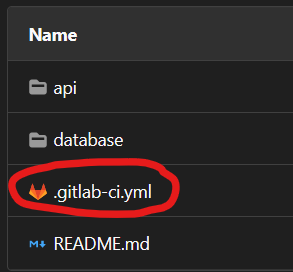
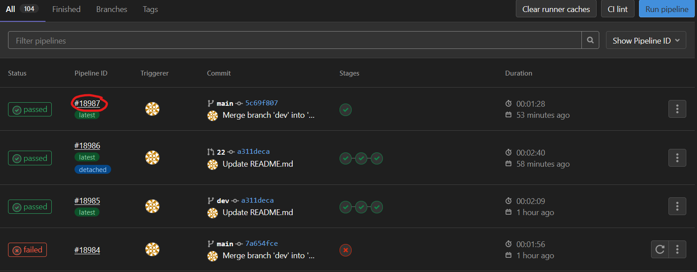
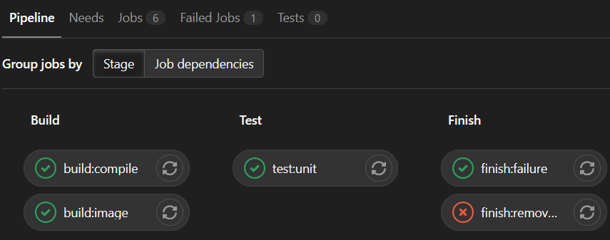
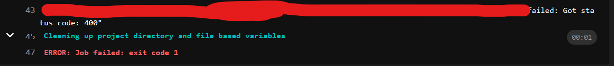

# Guide to Continuous Integration in your project

Why should you care about Continuous Integration (CI) and what does it actually do? Well...

The purpose of CI is to *continuously* test your code as you write it. The benefit of this is catching errors early in development, along with stopping overseen errors and bugs from reaching production. If that isn't enough to convince you, then you also have to realize that CI and its "friends" Continuous Delivery and Continuous Deployment are concepts widely used in software development. It is highly unlikely that none of use will run in to CI/CD in the future, so understanding it now will benefit us all.

Now how do you actually use what we (team 12) have developed, that'll be explained in the ["How to use and understand CI in your project"](#how-to-use-and-understand-ci-in-your-project) section. First there is some setup and general information to be read, but most of you have already been told some of it, so skip whatever is irrelevant.

* [Prerequisites](#prerequisites)
* [Git Workflow](#git-workflow)
* [Setup](#setup)
    * [Default branch](#default-branch)
	* [Protected branches](#protected-branches)
	* [Only merge when pipeline succeeds](#only-merge-when-pipeline-succeeds)
	* [The CI file](#the-ci-file)
* [Semantic versioning](#semantic-versioning)
* [How to use and understand CI in your project](#how-to-use-and-understand-ci-in-your-project)
    * [Inspecting pipelines](#inspecting-pipelines)
	* [Additional tips](#additional-tips)
	* [Releasing](#releasing)
* [Other issues](#other-issues)

## Prerequisites

In the end, each group should have the following things:

**Dockerfile**: One or more Dockerfiles that takes your compiled system and produces a final image for that microservice.

**Kubernetes manifest(s)**: This/these should describe how your system eventually will deploy to the production environment. This includes deployments and services.

**Tests**: Tests that verify that your system works as intended. These tests should preferably use some kind of recognized test-framework, so when a test fails it spits out a proper error for us to detect. Simply printing something if a test fails makes it much harder for us to detect when that test fails.

All of these things should be somewhere in your repository so we can make sure they're executed.

## Git Workflow

The Git Workflow that was decided upon for everyone, has the following MANDATORY branches:

**dev** - This branch should reflect the current version you are working on. Depending on how you set up your [protected branches](#protected-branches). 

**main** - This branch reflects the current working version that is in the production environment. This branch cannot be pushed to directly, it can only be merged into.

Everything else is up to the individual groups, but we STRONGLY advise to use feature branches, not personal branches or anything similar. We also strongly advise to only merge from dev to main, unless making hotfixes or using a release branch (more info on this is coming to this guide)

## Setup
To make sure the Git Workflow that has been decided on is being followed, a couple of things has to be setup.

### Default branch
Create a branch "dev" based on "main".

Maintainer goes to: Settings -> Repository -> Default branch. Set "dev" to be default branch.

### Protected branches
Maintainer goes to: Settings -> Repository -> Protected branches. Make sure "main" and "dev" are protected branches.

Maintainer + developers should be allowed to **merge** and **push** to dev(unless you decide something else).

No one should be able to **push** to main. Maintainer (and if you want, developers) should be able to **merge** to main.

### Only merge when pipeline succeeds

To make sure no faulty code goes to main, maintainer does the following:

Go to Settings -> General -> Merge Requests -> Merge checks, and check the box with "Pipelines must succeed".

### Always use merge commit for merging requests

In order for the merge request title to be used to specify a new release version, all merge requests to the production branch must always use the method merge commit.

Go to Settings -> General -> Merge Requests -> Merge method, and check the box with "Merge commit".

### The CI file

For this project, we have decided that the setup for CI in your project is mainly described in our repository. This means that all we ask of you is to insert a simple file in the root of your repository on EVERY SINGLE BRANCH. Sidenote: We can technically do this ourselves as each of us has been given "developer" role in the groups' repositories that we are working with, but to be transparent and as a guide to ourselves, here is what to do:

(this has to be done for every single branch. If you have branches that are not in use, delete them to make it easier)

1. Add a file called ".gitlab-ci.yml" in the root of your repository
  
  

2. Enter the file and write the following:

   ```yaml
   include:
       - project: 'semester-project-e2021/team-12/ci-cd'
         ref: main
         file: 'pipelines/team<team-number>.yml'
   ```

   But instead of "\<team-number\>" on line 4 write your team-number. For team 2 it would look like:

   ```yaml
   include:
       - project: 'semester-project-e2021/team-12/ci-cd'
         ref: main
         file: 'pipelines/team02.yml'
   ```

3. Commit the changes. 

As stated, this should be done for all branches. When doing this for the main branch, it gets a little complicated.

Earlier you enabled a setting to stop merging from happening unless the pipeline succeeds(see [Only merge when pipeline succeeds](#only-merge-when-pipeline-succeeds))... well currently there is no pipeline to succeed, or it probably fails. So do the following:

1. Maintainer go to Settings -> General -> Merge Requests -> Merge checks, and UNcheck the box with "Pipelines must succeed".
2. Create a branch from main
3. Add and/or edit the file as above
4. Commit
5. Create merge-request from this new branch to main
6. Merge
7. Maintainer go to Settings -> General -> Merge Requests -> Merge checks, and check the box again with "Pipelines must succeed".

We apologize for the premature setup of the settings causing this setup to be necessary. If there are any issues, contact us.

## Semantic versioning
Use [semantic versioning 2.0.0](https://semver.org/).

### Version 1.2.3
1. MAJOR version when you make incompatible API changes,
2. MINOR version when you add functionality in a backwards compatible manner, and
3. PATCH version when you make backwards compatible bug fixes. 

Additional labels for pre-release and build metadata are available as extensions to the MAJOR.MINOR.PATCH format.

### Add Label for Pre-release
Pre-release version may be denoted by a hyphen and only contain ASCII alphanumerics and hyphens [0-9A-Za-z-]. A numeric identifiers can not have leading zeroes.

Examples:

    1.0.0-alpha, 1.0.0-alpha.1, 1.0.0-0.3.7

(!) Pre-release version has lower priority than the normal version MAJOR.MINOR.PATCH.

Example:

    1.0.0-alpha < 1.0.0-alpha.1 < 1.0.0-alpha.beta < 1.0.0-beta < 1.0.0-beta.2 < 1.0.0-beta.11 < 1.0.0-rc.1 < 1.0.0

### Add Build Metadata
Metadata may be denoted by a plus sign and only contain ASCII alphanumerics and hyphens [0-9A-Za-z-].

Example:

    1.0.0-alpha+mockup

(!) The metadata is always ignored by version prioritization.

Example:

    1.0.0-alpha+mockup = 1.0.0-alpha+mockup-101230 = 1.0.0-alpha+mockup.1


## How to use and understand CI in your project

CI in GitLab uses **pipelines**. Every time you do some commit/push/merge or similar, a pipeline can be triggered and execute some **jobs**. For example when you create a merge request to main, a pipeline will begin and use the shared runner of this GitLab group, to execute a bunch of jobs that tests your code and more.

### Inspecting pipelines

To see the pipelines, go to your repository, find "CI/CD" in your sidebar and select "Pipelines". This should give you a list of all pipelines, this includes failed, passed and currently running pipelines. This view contains information about who triggered the pipeline, how far the pipeline is in it's progress, what commit triggered it, and more. To inspect a pipeline click the pipeline id.



You should now be seeing a view of the stages (categorization of jobs) and the jobs. 



It should be clear which jobs have or haven't been run, and which jobs passed or failed. To inspect a job, simply click it, and here you will see the CLI for the runner when it executed that job, but you cannot interact with this, you can merely look what the runner did, and see error messages if there are any. This is where you should figure out what went wrong, if a job did not pass.



#### Additional tips

If you created a merge-request that triggered a certain pipeline, you will see information regarding that pipeline in the merge request, and you can click the id to go to the pipeline.

### Releasing

To release, you first make a merge-request to main with the title being your version number (use semantic versioning) or "mockup". This will start a pipeline which will run your test and build your images. If your merge-request title is a version that already exists, or is something different than a 3-numbered version number, the pipeline fails and you have to edit the merge request and retry the pipeline . 

At this stage you can [follow the progress of the pipeline](#inspecting-pipelines) and see if any tests fail or errors occur. When the pipeline succeeds you approve the merge-request and merge to main, which will then deploy your release (when that is implemented).

The details of where your Dockerfile(s) and Kubernetes manifest is located can be discussed with your CI-contact.


## Other issues
Contact us if other issues or doubts:
- Sebastian, Discord: SebastianM#4015
- Frederik Primdahl, Discord: PrettyFace#7904
- Frederik Nørager, Discord: FnhNielsen#2831
- Magnus, Discord: MagnusSoerensen#2710
- Simon, Discord: simonkruger10#2409
